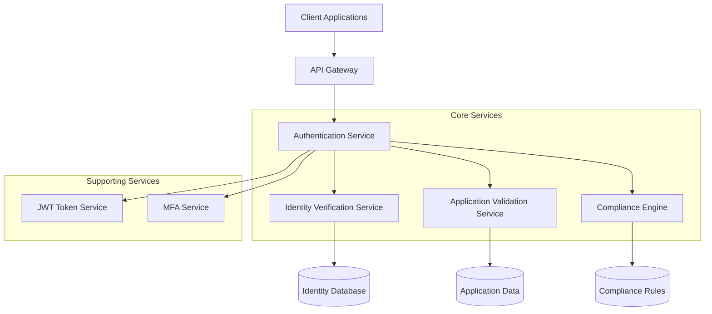
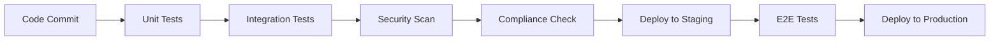

# Authentication System Technical Design

## Overview

The Authentication System [module-auth-system] is a comprehensive user authentication and authorization system designed to support secure access control across home lending applications. This system integrates regulatory compliance requirements, automated validation processes, and identity verification capabilities to ensure secure and compliant user authentication.

The system implements OAuth 2.0 protocols with JWT token management and multi-factor authentication (MFA) support. It addresses critical compliance requirements including TRID regulations while providing robust identity verification and application validation capabilities.

**Key Components:**
- OAuth 2.0/JWT authentication framework
- Multi-factor authentication (MFA)
- Automated application validation [atom-sys-application-validation]
- Identity verification services [atom-sys-identity-verification]
- TRID compliance enforcement [atom-pol-trid-compliance]

## Architecture

The Authentication System follows a microservices architecture pattern with clear separation of concerns between authentication, authorization, and compliance components.



### Core Architecture Components

1. **Authentication Service**: Central OAuth 2.0 implementation managing user sessions and token lifecycle
2. **Identity Verification Module**: Implements [atom-sys-identity-verification] for customer identity validation using SSN, address, and additional data points
3. **Application Validation Engine**: Executes [atom-sys-application-validation] to ensure completeness of required fields and application data integrity
4. **Compliance Framework**: Enforces [atom-pol-trid-compliance] requirements throughout the authentication flow

## Data Models

### User Authentication Model
```json
{
  "userId": "string (UUID)",
  "username": "string",
  "email": "string",
  "hashedPassword": "string",
  "mfaEnabled": "boolean",
  "mfaSecret": "string (encrypted)",
  "roles": ["array of role objects"],
  "lastLogin": "datetime",
  "accountStatus": "enum (active, suspended, locked)",
  "complianceFlags": {
    "tridCompliant": "boolean",
    "identityVerified": "boolean",
    "applicationValidated": "boolean"
  }
}
```

### Identity Verification Model
The [atom-sys-identity-verification] process utilizes:
```json
{
  "verificationId": "string (UUID)",
  "userId": "string (UUID)",
  "ssn": "string (encrypted)",
  "address": {
    "street": "string",
    "city": "string",
    "state": "string",
    "zipCode": "string"
  },
  "verificationStatus": "enum (pending, verified, failed)",
  "verificationMethods": ["ssn_check", "address_validation", "credit_check"],
  "verificationTimestamp": "datetime"
}
```

### Application Validation Model
Supporting [atom-sys-application-validation] requirements:
```json
{
  "applicationId": "string (UUID)",
  "userId": "string (UUID)",
  "completenessScore": "number (0-100)",
  "requiredFields": ["array of field names"],
  "validationResults": {
    "missingFields": ["array"],
    "invalidFields": ["array"],
    "warnings": ["array"]
  },
  "tridCompliance": {
    "disclosuresProvided": "boolean",
    "timingRequirementsMet": "boolean"
  }
}
```

## APIs and Integrations

### Authentication Endpoints

#### OAuth 2.0 Flow
- `POST /auth/oauth/token` - Token generation and refresh
- `POST /auth/oauth/revoke` - Token revocation
- `GET /auth/oauth/userinfo` - User information retrieval

#### Identity Verification Integration
The system integrates [atom-sys-identity-verification] through:
- `POST /auth/verify/identity` - Initiate identity verification
- `GET /auth/verify/status/{userId}` - Check verification status
- `PUT /auth/verify/complete` - Complete verification process

#### Application Validation Integration
Supporting [atom-sys-application-validation]:
- `POST /auth/validate/application` - Trigger application completeness check
- `GET /auth/validate/results/{applicationId}` - Retrieve validation results

### External Integrations

1. **Credit Bureau APIs** - For identity verification support
2. **Address Validation Services** - Supporting [atom-sys-identity-verification]
3. **Compliance Database** - Enforcing [atom-pol-trid-compliance] rules
4. **Audit Logging Service** - TRID compliance tracking

## Security Considerations

### Authentication Security
- **JWT Token Security**: RS256 algorithm with rotating keys
- **Password Policy**: Minimum 12 characters, complexity requirements
- **MFA Implementation**: TOTP-based with backup codes
- **Session Management**: Secure session handling with automatic timeout

### Compliance Security
The [atom-pol-trid-compliance] policy requires:
- Encrypted storage of all personal identifiable information
- Audit trails for all authentication events
- Secure transmission of disclosure documents
- Timing compliance for TRID disclosure requirements

### Identity Verification Security
The [atom-sys-identity-verification] process implements:
- SSN encryption at rest and in transit
- Multi-source identity validation
- Fraud detection algorithms
- Secure API communications with verification services

### Application Validation Security
The [atom-sys-application-validation] system ensures:
- Data integrity validation
- Secure handling of sensitive application data
- Compliance with data retention policies

## Deployment Strategy

### Infrastructure Requirements
- **Container Platform**: Docker containers on Kubernetes
- **Database**: PostgreSQL 14+ with encryption at rest
- **Cache Layer**: Redis 6+ for session management
- **Load Balancer**: NGINX with SSL termination

### Deployment Environments

#### Development Environment
- Single-instance deployment
- Mock identity verification services
- Simplified [atom-pol-trid-compliance] validation

#### Staging Environment
- Multi-instance setup mirroring production
- Full integration with [atom-sys-identity-verification] services
- Complete [atom-sys-application-validation] testing
- TRID compliance validation testing

#### Production Environment
- High-availability multi-zone deployment
- Full integration with all external services
- Complete implementation of [atom-pol-trid-compliance] requirements
- Real-time monitoring and alerting

### Deployment Pipeline


## Dependencies

### Internal Dependencies
- **Home Lending Core Platform**: Primary integration point
- **Compliance Management System**: Enforces [atom-pol-trid-compliance] requirements
- **Application Processing System**: Consumes [atom-sys-application-validation] results
- **Customer Management System**: Utilizes [atom-sys-identity-verification] outcomes

### External Dependencies
- **OAuth 2.0 Libraries**: Node.js passport-oauth2 v1.6+
- **JWT Libraries**: jsonwebtoken v8.5+
- **Identity Verification Providers**: 
  - Experian Identity API v2.0
  - LexisNexis Risk Solutions API v3.1
- **MFA Services**: Google Authenticator compatible TOTP

### Database Dependencies
- **PostgreSQL**: Version 14+ for primary data storage
- **Redis**: Version 6+ for session and cache management
- **MongoDB**: Version 5+ for audit log storage (TRID compliance)

### Third-Party Services
- **Address Validation**: USPS API for [atom-sys-identity-verification]
- **Credit Bureau Integration**: Supporting identity verification workflows
- **Compliance Database**: CFPB TRID rule database for [atom-pol-trid-compliance]
- **Audit Service**: SOC 2 compliant logging for regulatory requirements

**Atom Traceability Summary:**
- TRID Compliance: [atom-pol-trid-compliance]
- Application Validation: [atom-sys-application-validation]  
- Identity Verification: [atom-sys-identity-verification]